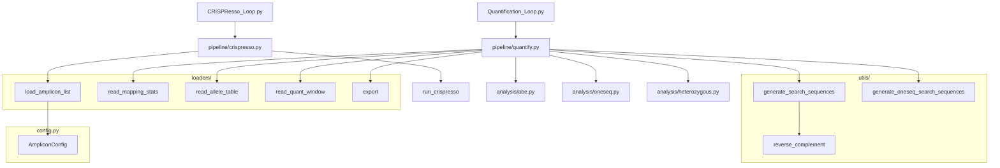

# AQ Pipeline V2 — Architecture

## Call Graph

## Module Summary

| File | Status | Purpose |
|---|---|---|
| `config.py` | Done | AmpliconConfig dataclass |
| `utils/sequences.py` | Done | reverse_complement, generate_search_sequences, generate_oneseq_search_sequences |
| `loaders/amplicon_list.py` | Done | Parse amplicon_list.csv into AmpliconConfig objects |
| `loaders/crispresso_output.py` | Done | Read CRISPResso allele table and mapping stats |
| `loaders/export.py` | Done | Write summary CSV and PRISM output |
| `analysis/abe.py` | Done | ABE correction metric calculations |
| `analysis/heterozygous.py` | Done | Het position detection and allele splitting |
| `analysis/oneseq.py` | Done | ONE-seq A-to-G analysis |
| `pipeline/crispresso.py` | Done | Stage 1 — amplicon matching, run CRISPResso on each sample |
| `pipeline/quantify.py` | Done | Stage 2 — orchestrate analysis, assemble results |
| `CRISPResso_Loop.py` | Done | Entry point for Stage 1 |
| `Quantification_Loop.py` | Done | Entry point for Stage 2 |
