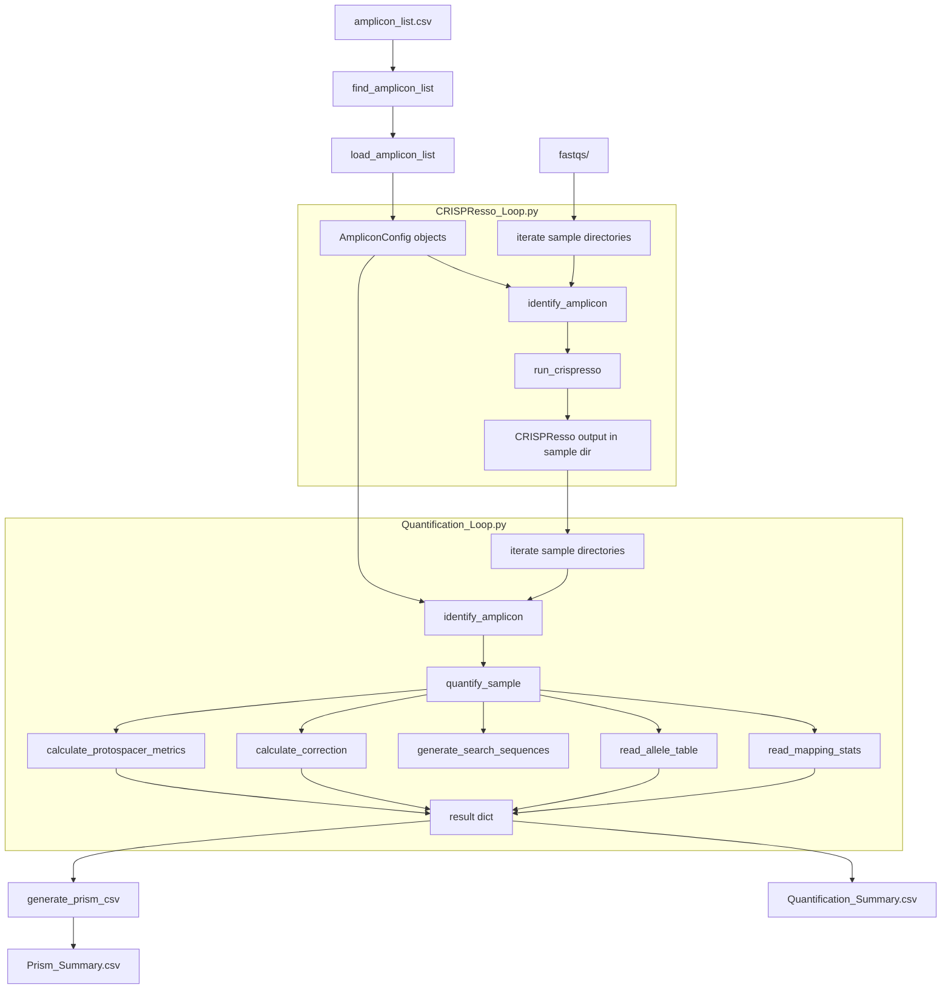

```mermaid
flowchart TD
    A[amplicon_list.csv] --> B[find_amplicon_list]
    B --> C[load_amplicon_list]
    C --> D[AmpliconConfig objects]

    E[fastqs/] --> F

    subgraph Stage1 [CRISPResso_Loop.py]
        F[iterate sample directories] --> G[identify_amplicon]
        D --> G
        G --> H[run_crispresso]
        H --> I[CRISPResso output in sample dir]
    end

    subgraph Stage2 [Quantification_Loop.py]
        I --> J[iterate sample directories]
        D --> K[identify_amplicon]
        J --> K
        K --> L[quantify_sample]
        L --> M[read_mapping_stats]
        L --> N[read_allele_table]
        L --> O[generate_search_sequences]
        L --> P[calculate_correction]
        L --> Q[calculate_protospacer_metrics]
        P --> R[result dict]
        Q --> R
        M --> R
        N --> R
    end

    R --> S[Quantification_Summary.csv]
    R --> T[generate_prism_csv]
    T --> U[Prism_Summary.csv]
```